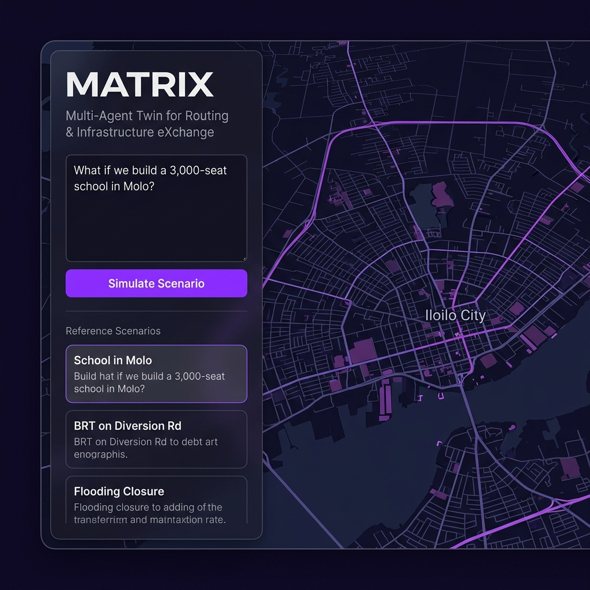
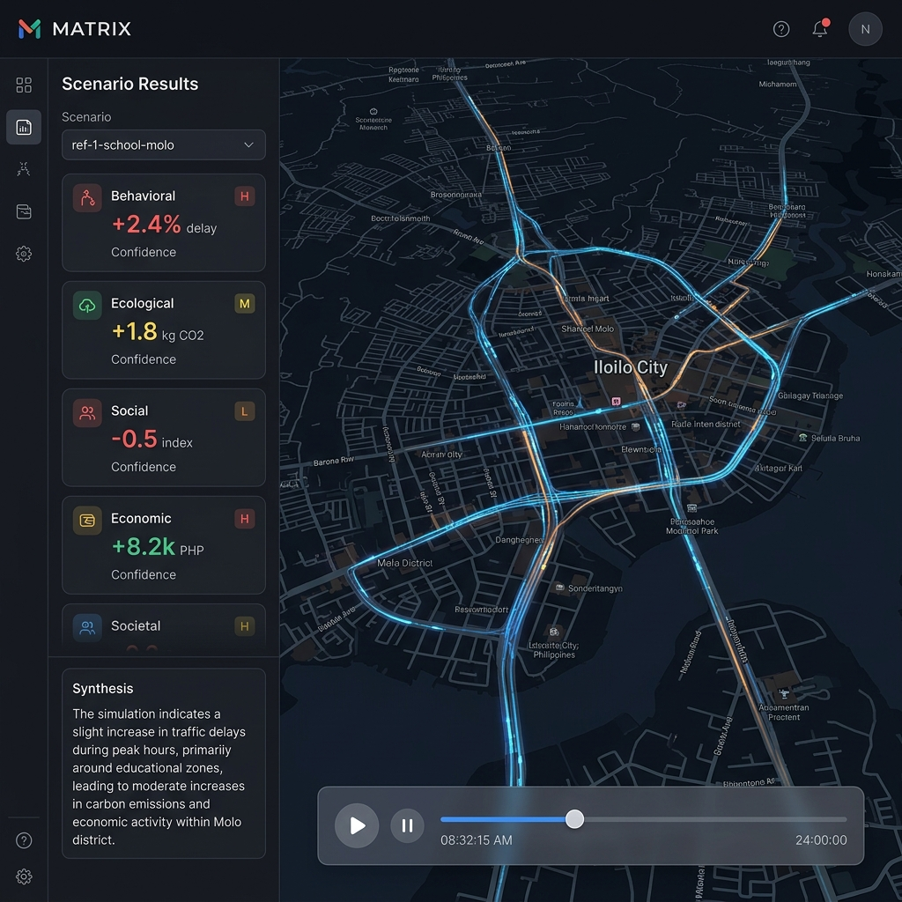
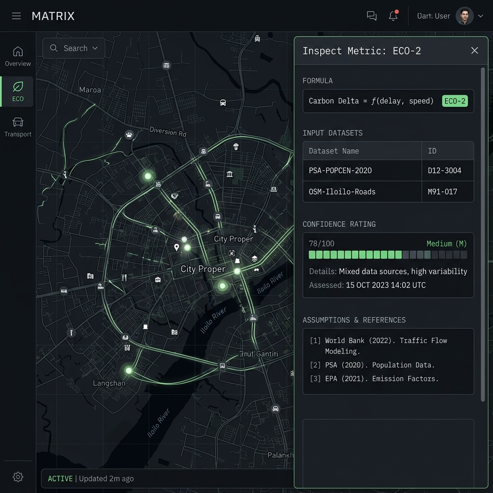

# MATRIX

**Multi-Agent Twin for Routing & Infrastructure eXchange** — a pre-construction infrastructure impact simulator for ASEAN cities, piloting in **Iloilo City**. Built by Team **ATLAN** (Polytechnic University of the Philippines) for the **ASEAN AI Hackathon 2026**, Smart Cities track.

> **Repo status:** The **planning, data, and documentation** workspace — now with the active build nested in [`app/`](app/) (one clone, data co-located).
> 
> **Build Progress:** 
> * **Phase 1 (Data Layer Pipeline)**: Fully operational. Converted OSM/Overture roads into a routable SUMO network, generated traffic analysis zones (TAZs), and extracted LPTRP route geometries.
> * **Phase 2 (Simulation Kernel)**: Fully operational. Features a headless SUMO trajectory generator, TraCI-based scenario delta runner, and Redis baseline/delta caching.
> * **Phase 3 & 4 (Scoring Modules & LLM Synthesis)**: Fully operational. All 5 glass-box impact modules (Behavioral, Ecological, Social, Economic, Societal) score the trajectories. A Gemini 3.1 Pro agent synthesizes these results, citing precise `equation_id` and `dataset_ids`.
> * **Phase 5 (Frontend Dashboard)**: Fully operational. A Next.js 14 + Deck.gl (TripsLayer) app features real-time WebSocket streaming playback, an interactive Inspect drawer for glass-box audits, and bias/validation logs.

---

## Visual Walkthrough

Here is a walk-through of the operational MATRIX application:

### 1. Landing Page
Enter a natural language prompt to specify the scenario parameters (e.g., placing a high-occupancy school in Molo). The application will parse the query and initialize the simulation.


### 2. Live Simulation & 5-Dimension Dashboard
When the simulation is started, the frontend establishes a WebSocket connection to stream real-time vehicle trajectories over a 3D map of Iloilo City using Deck.gl (`TripsLayer`). The sidebar populates with 5-dimension scoring metrics, each showing a dynamically computed value, unit, sensitivity range, and data confidence score (High/Medium/Low).


### 3. Glass-Box Inspect Drawer
Every metric value is fully traceable. Clicking on a metric opens the Inspect Drawer to audit the source formulas, database inputs, assumptions, and scientific references, establishing a strict "glass-box" audit trail.


---

## Quick start (developers)

**Prerequisites:** Python 3.12+, Node.js (v20+), Git, Docker (for datastores and headless SUMO). Windows/macOS/Linux all supported.

### 1. Start Local Datastores
Local datastores (Postgres with PostGIS, Redis, and ChromaDB) run via Docker:
```bash
cd app
docker compose up -d
```

### 2. Start the Backend API
The FastAPI backend serves scenario parsing and WebSocket trajectory streaming:
```bash
cd app/apps/api
uv sync
uv run uvicorn matrix_api.main:app --reload
```

### 3. Start the Frontend Application
Run the Next.js development server:
```bash
cd app/apps/web
npm install
npm run dev
```
Open [http://localhost:3000](http://localhost:3000) to view the application.

### 4. Run Test Suite (Kernel & Modules)
Run the unit tests to verify the simulation kernel and glass-box contracts:
```bash
cd app/packages/kernel
uv sync
uv run pytest
```

---

## Where things are

| Path | What it is |
|---|---|
| **[MATRIX.md](MATRIX.md)** | Canonical product + technical spec — the single source of truth. **Read first.** |
| [data/INVENTORY.md](data/INVENTORY.md) | Live data manifest — every dataset: link, license, vintage, confidence, status. |
| [data/READINESS.md](data/READINESS.md) | Data mapped to the 5 impact dimensions, with confidence + real gaps. |
| [MATRIX_Iloilo_Data_Sources.md](MATRIX_Iloilo_Data_Sources.md) | Source rationale, tiers, OSM bounding boxes. |
| [data/fetch/](data/fetch/) | Re-runnable fetch scripts (Python stdlib; idempotent). |
| [data/processed/](data/processed/) | Analysis-ready, git-tracked outputs (Iloilo CCHAIN subset). |
| [data/outreach/](data/outreach/) | Send-ready contact drafts — only for fidelity upgrades; none block the build. |
| [reference/](reference/) | AAIH admin & deliverables (roadmap, orientation). |
| [CLAUDE.md](CLAUDE.md) | Operating guide for AI coding agents in this repo. |
| `docs/` | Formal doc suite — PRD, SDD, QAD… — generated via the FMD framework. |

## Data layout

```
data/
  raw/        # fetched as-is — GITIGNORED (large / third-party / regenerable)
  interim/    # conversions (OSM->SUMO net, partial GTFS) — GITIGNORED
  processed/  # analysis-ready, git-tracked (Iloilo CCHAIN subset)
  fetch/      # download scripts
  outreach/   # contact drafts (last resort)
  INVENTORY.md   READINESS.md   README.md
```

## Conventions

- **Never commit `data/raw/`, `data/interim/`, or secrets.** They're gitignored; regenerate raw with the fetch scripts.
- **Branch off `main`** and open a PR. Keep history clean — separate commits for data vs docs.
- **Data honesty:** every dataset carries a confidence tier (H/M/L). Don't launder estimates as precision — confidence-bounded output is the product's core differentiator (see [READINESS](data/READINESS.md)).
- **Prefer the newest vintage** (e.g. 2024 POPCEN-CBMS, not 2020).

---

## Team — ATLAN

| Member | Role |
|---|---|
| **Carlos Jerico Dela Torre** | AI & Software Development · Product & Business Architecture · **Team Lead** |
| **Yushin Bjorn Matsuda** | AI & Software Development · UI/UX Design |
| **Maria Espina** | QA · UI/UX Design |
| **Rica Mae Mago** | QA · Research & Marketing |
| **Russell Jay Fajardo** | QA · Research & Marketing |

Ownership, DRIs, and the RACI are in [docs/prd-matrix.md §10](docs/prd-matrix.md).

---

*PUP-ATLAN · Polytechnic University of the Philippines · ASEAN AI Hackathon 2026 · Smart City*
