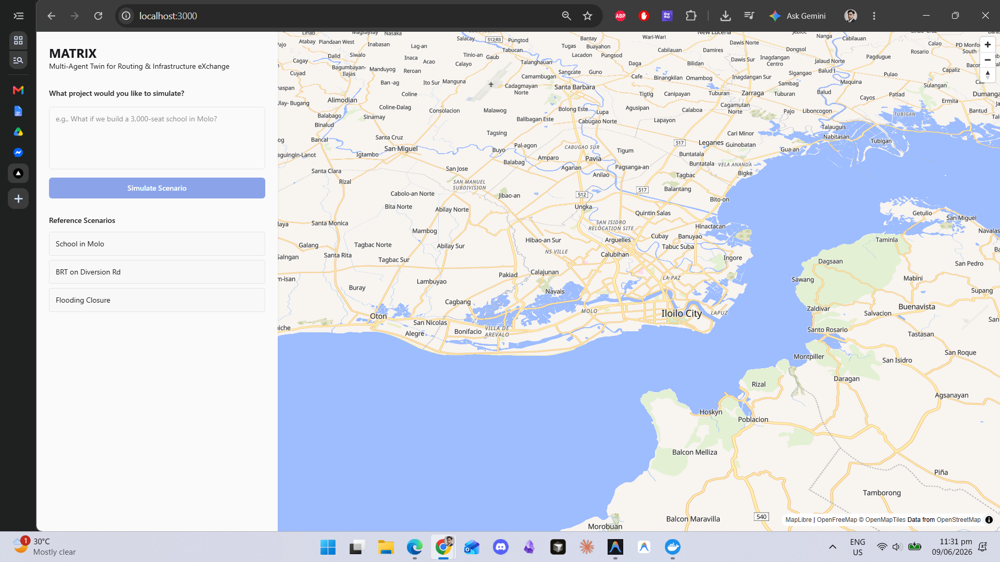
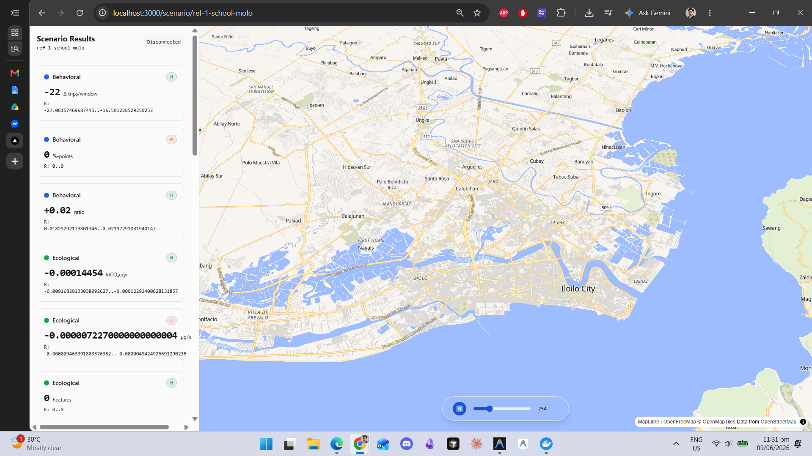
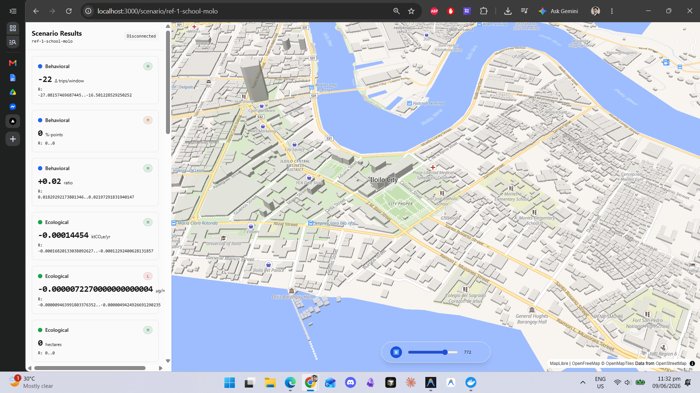

# MATRIX

**Multi-Agent Twin for Routing and Infrastructure eXchange** is a pre-construction infrastructure impact simulator for ASEAN cities, piloting in Iloilo City. Built by Team **ATLAN** (Polytechnic University of the Philippines) for the ASEAN AI Hackathon 2026, Smart Cities track.

*(Note: While our acronym includes the word "Twin", the system operates strictly as a simulator. It relies on static and historical data rather than real-time live feeds to model scenarios.)*

---

## 1. INTRODUCTION

Urban development in fast-growing ASEAN cities like Iloilo City often faces a critical problem. Planners build new infrastructure without fully understanding its ripple effects on traffic, local businesses, and the environment. Traditional planning methods are slow, separated by departments, and struggle to predict complex human behavior. Our primary objective is to provide city planners with a tool to simulate and evaluate the impact of proposed infrastructure changes before any construction begins. AI is necessary for this challenge because it can rapidly analyze massive amounts of urban data, generate realistic mobility patterns, and evaluate outcomes across multiple dimensions (social, economic, ecological) far faster than manual analysis.

## 2. PROBLEM CONTEXT & SOLUTION OVERVIEW

In the ASEAN context, rapid urbanization often outpaces infrastructure development. This leads to congestion, pollution, and economic bottlenecks. Our stakeholders include urban planners, local government units, and citizens who are affected by these changes. We considered various data factors such as road networks, historical traffic patterns, business locations, and environmental baselines. 

Our AI system's core functionality allows users to input a proposed infrastructure change in plain language (for example, "Build a new school in Molo"). The system then runs a simulation to model how people and traffic will adapt to this change. It scores the outcomes across five dimensions: Behavioral, Ecological, Social, Economic, and Societal. This provides planners with a complete view of the project's potential impact.

## 3. AI TOOLS & METHODS USED

Our prototype leverages several advanced AI tools and frameworks:
* **Gemini 3.1 Pro and Flash-Lite**: Used as the core orchestration agents to understand natural language scenarios, generate diverse commuter personas, and write the final impact reports with strict citation tracking.
* **Eclipse SUMO**: An open-source traffic simulation suite used to model the physical movement of vehicles and pedestrians.
* **FastAPI and Next.js**: Provide the robust backend API and the interactive frontend dashboard for users to run simulations and view results.
* **Deck.gl**: Used for rendering the 3D map and displaying vehicle movements.
* **Supabase, ChromaDB, and Redis**: Handle data storage, document retrieval for context, and caching for fast simulation responses.

## 4. ASSESSMENT OF AI OUTPUT (CRITICAL EVALUATION)

**Accuracy:** The technical output of our AI system is limited by the quality of the input data. To ensure accuracy, every metric generated by the AI is strictly tied to specific data sources and mathematical formulas through a clear audit trail. The system does not invent numbers. It only calculates them based on established transportation and economic models. 

**Technical Bias:** We actively reduce Western-centric bias by basing our simulation in localized ASEAN data, specifically using public records, OpenStreetMap data, and local transport routes from Iloilo City. While some underlying AI models may lean towards generic urban assumptions, our prompt engineering explicitly forces the AI to base its synthesis purely on the local simulation results and local datasets. This ensures the context remains relevant to the region.

---

## Visual Walkthrough

Here is a walk-through of the MATRIX application, showing our current working prototype alongside our ideal end goals.

### 1. Landing Page
Enter a plain language prompt to specify the scenario parameters. The application will understand the query and set up the simulation.

**Current Prototype:**


**Ideal Goal:**


### 2. Live Simulation & Dashboard
When the simulation starts, the frontend connects to stream vehicle movements over a 3D map of Iloilo City. The sidebar shows scoring metrics for the different impact dimensions.

**Current Prototype:**


**Ideal Goal:**


### 3. Glass-Box Inspect Drawer
Every metric value can be traced back to its source. Clicking on a metric opens the Inspect Drawer to view the formulas, data inputs, and references used.

**Current Prototype:**


**Ideal Goal:**


---

## Quick Start (Developers)

**Prerequisites:** Python 3.12+, Node.js (v20+), Git, Docker. Windows, macOS, and Linux are supported.

### 1. Start Local Datastores
Local datastores run via Docker:
```bash
cd app
docker compose up -d
```

### 2. Start the Backend API
The FastAPI backend serves scenario parsing and trajectory streaming:
```bash
cd app/apps/api
uv sync
uv run uvicorn matrix_api.main:app --reload
```

### 3. Start the Frontend Application
Run the Next.js development server:
```bash
cd app/apps/web
npm install
npm run dev
```
Open [http://localhost:3000](http://localhost:3000) to view the application.

### 4. Run Test Suite
Run the unit tests to verify the simulation logic:
```bash
cd app/packages/kernel
uv sync
uv run pytest
```

---

## Where Things Are

| Path | Description |
|---|---|
| **[MATRIX.md](MATRIX.md)** | Canonical product and technical specification. |
| [data/INVENTORY.md](data/INVENTORY.md) | Live data manifest. |
| [data/READINESS.md](data/READINESS.md) | Data mapped to the impact dimensions. |
| [MATRIX_Iloilo_Data_Sources.md](MATRIX_Iloilo_Data_Sources.md) | Source rationale and details. |
| [CLAUDE.md](CLAUDE.md) | Operating guide for AI coding agents. |
| `docs/` | Formal documentation suite. |

## Data Layout

```
data/
  raw/        # fetched as is (gitignored)
  interim/    # conversions (gitignored)
  processed/  # analysis-ready and git-tracked
  fetch/      # download scripts
  outreach/   # contact drafts
  INVENTORY.md   READINESS.md   README.md
```

## Conventions

* **Never commit raw or interim data, or secrets.** They are gitignored. Regenerate raw data with the fetch scripts.
* **Branch off main** and open a pull request. Keep history clean.
* **Data honesty:** every dataset carries a confidence tier. We do not present estimates as absolute facts.
* **Prefer the newest data** when available.

---

## Team ATLAN

| Member | Role |
|---|---|
| **Carlos Jerico Dela Torre** | AI & Software Development, Product & Business Architecture, **Team Lead** |
| **Yushin Bjorn Matsuda** | AI & Software Development, UI/UX Design |
| **Maria Espina** | QA, UI/UX Design |
| **Rica Mae Mago** | QA, Research & Marketing |
| **Russell Jay Fajardo** | QA, Research & Marketing |

Ownership details are in [docs/prd-matrix.md §10](docs/prd-matrix.md).

---

*PUP-ATLAN (Polytechnic University of the Philippines) for ASEAN AI Hackathon 2026 (Smart City)*
