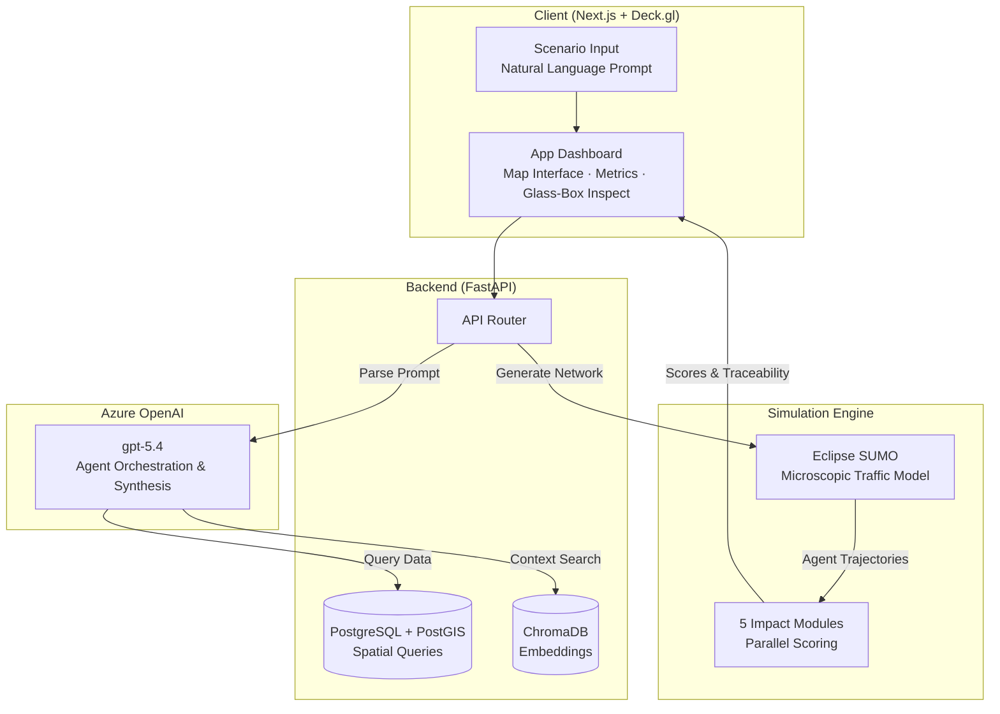
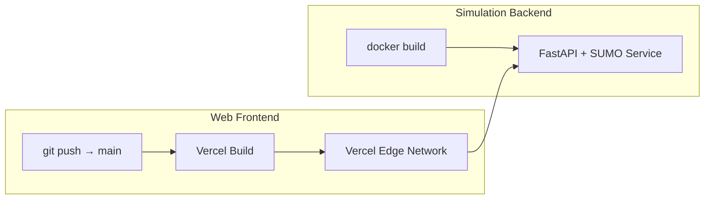

# MATRIX

<div align="center">


**See the impact *before* you build it.**

Multi-Agent Twin for Routing and Infrastructure eXchange. A pre-construction infrastructure impact simulator designed for fast-growing ASEAN cities, currently piloting in Iloilo City.

<p>
  
  
  
  
  
</p>

[**🔗 Visit Live App: matrix-atlan.vercel.app**](https://matrix-atlan.vercel.app)

</div>

---

## 🧩 Problem

Rapid urbanization in ASEAN cities often outpaces infrastructure development. Planners are forced to make multi-billion-peso decisions using static, isolated feasibility studies that age the day they are filed.

Traditional methods struggle to predict how humans and traffic adapt to complex changes like a new school, a transit line, or a temporary road closure.

---

## 🌟 Vision

A future where city planners can visualize and quantify the exact consequences of an urban change *before* breaking ground. By merging generative AI with microscopic traffic simulation, MATRIX turns complex predictive modeling into a conversational, glass-box experience accessible to policymakers and citizens alike.

---

## 🎯 Purpose

Built for the **ASEAN AI Hackathon 2026 (Smart Cities Track)**, MATRIX was born from the realization that cities lack an integrated platform to measure multi-dimensional impacts. Planners typically use different tools for traffic, economic, and ecological studies, leading to disconnected models and massive overhead. MATRIX unites these dimensions into a single generative pipeline.

---

## 👥 Target Users

- **Primary — Urban Planners & City Officials**: Need to evaluate zoning changes, new developments, or transit routes comprehensively to allocate budgets, reduce risk, and secure public buy-in.
- **Secondary — Civil & Traffic Engineers**: Tasked with analyzing the micro-effects of infrastructure projects on existing road networks and traffic signals.

---

## ✨ Features

- **Localized Natural Language (Hiligaynon Support)** — Drop a proposed project onto a city map using plain language. The system maps colloquial terms (e.g., *"siraon ang tulay sa Forbes"*) directly to exact GIS nodes. No complex CAD models or coding required.
- **Equity & Informal Sector Modeling** — Beyond middle-class traffic, the Economic and Social dimensions explicitly account for vulnerable sectors like tricycle routing catchments and street vendor displacement.
- **Active Bias Auditing** — A built-in Bias Auditor continuously monitors and mathematically reweights simulated personas to prevent skew and ensure marginalized demographics are represented.
- **Glass-Box Traceability & Ground-Truth** — No black boxes. Every generated number is traceable to its source dataset (PSA, BIR, DOT) and mathematical formula via the Inspect Drawer. The system validates against historical data (e.g., Calderon 2014 corridor flows).
- **Extreme-Event Resilience Testing** — Planners aren't limited to sunny-day scenarios. MATRIX natively models compound shocks like sudden road closures and 25-year monsoon flooding to stress-test city resilience.
- **CPDO Governance Loop** — A built-in mechanism for City Planning and Development Office (CPDO) staff to rate outputs, attach ground-truth corrections, and iteratively refine the AI's future simulations.

---

## 🛠️ Tech Stack

| Layer | Technology |
| --- | --- |
| **Frontend** | Next.js 14 (App Router), React, TypeScript, Tailwind CSS, shadcn/ui, Deck.gl |
| **Backend** | FastAPI (Python), TraCI API |
| **Simulation Engine** | Eclipse SUMO (Simulation of Urban MObility) |
| **Database & Search** | PostgreSQL (with PostGIS), Redis, ChromaDB |
| **Generative AI** | Azure OpenAI (gpt-5.4) |
| **Hosting & CI/CD** | Vercel (Frontend), Docker / Custom Cloud (Backend) |

---

## Architecture

### System Flow


```mermaid
graph TD
    subgraph Client ["Client (Next.js + Deck.gl)"]
        UI["App Dashboard<br/>Map Interface · Metrics · Glass-Box Inspect"]
        INPUT["Scenario Input<br/>Natural Language Prompt"]
    end

    subgraph LLM ["Azure OpenAI"]
        GPT["gpt-5.4<br/>Agent Orchestration & Synthesis"]
    end

    subgraph Backend ["Backend (FastAPI)"]
        API["API Router"]
        DB[("PostgreSQL + PostGIS<br/>Spatial Queries")]
        VDB[("ChromaDB<br/>Embeddings")]
    end

    subgraph Simulation ["Simulation Engine"]
        SUMO["Eclipse SUMO<br/>Microscopic Traffic Model"]
        EVAL["5 Impact Modules<br/>Parallel Scoring"]
    end

    INPUT --> UI
    UI --> API
    API --> |"Parse Prompt"| GPT
    GPT --> |"Query Data"| DB
    GPT --> |"Context Search"| VDB
    API --> |"Generate Network"| SUMO
    SUMO --> |"Agent Trajectories"| EVAL
    EVAL --> |"Scores & Traceability"| UI
```

### Build & Deploy


```mermaid
graph LR
    subgraph simulation ["Simulation Backend"]
        BUILD["docker build"]
        BUILD --> FAST["FastAPI + SUMO Service"]
    end

    subgraph app ["Web Frontend"]
        PUSH["git push → main"] --> VRC["Vercel Build"]
        VRC --> EDGE["Vercel Edge Network"]
    end

    EDGE --> FAST
```

### Directory Structure

```text
matrix/
├── app/                      Next.js frontend
├── data/                     Datasets
│   ├── raw/                  Raw economic/demographic data
│   ├── processed/            Cleaned spatial data
│   └── INVENTORY.md          Data inventory and tracking
├── docs/                     Product documentation
│   ├── prd-matrix.md         Product requirements
│   ├── sdd-matrix.md         System design
│   ├── dsd-matrix.md         Design system
│   ├── methods-matrix.md     Equations and glass-box ledger
│   └── rfc-*.md              Feature RFCs
├── scripts/                  Automation and deployment scripts
├── DEVELOPERS.md             Quick Start and developer conventions
├── MATRIX.md                 Canonical architecture and decisions
├── CLAUDE.md                 Operating Guide for AI Agents
└── README.md                 ← You are here
```

---

## 🚀 How to Run Locally

### Prerequisites

- **Node.js 18+**
- **Python 3.11+**
- **Eclipse SUMO** installed and accessible via PATH
- **PostgreSQL** + PostGIS

### Frontend

```bash
cd app
npm install
npm run dev
```

Open [http://localhost:3000](http://localhost:3000).

### Backend / Simulation

```bash
cd backend
python -m venv venv
source venv/bin/activate  # or venv\Scripts\activate on Windows
pip install -r requirements.txt
uvicorn main:app --reload
```

---

## 👨‍💻 Meet Team ATLAN

Built for the **ASEAN AI Hackathon 2026** (Smart Cities Track) by students from the Polytechnic University of the Philippines.

| Name | Role |
| --- | --- |
| [**Carlos Jerico Dela Torre**](https://www.linkedin.com/in/delatorrecj) | AI & Software Development, Business & Product Architecture (Lead) |
| [**Yushin Bjorn Matsuda**](https://www.linkedin.com/in/matsuda-yushin) | AI & Software Development, UI/UX Design |
| [**Maria Espina**](www.linkedin.com/in/ma-kristina-espina-b89243309) | QA, UI/UX Design |
| [**Rica Mae Mago**](https://www.linkedin.com/in/rica-mae-mago) | QA, Research & Marketing |
| [**Russell Jay Fajardo**](https://www.linkedin.com/in/russell-jay-fajardo-775b19307) | QA, Research & Marketing |

---

## 📈 Roadmap

| Phase | Focus | Status |
| --- | --- | --- |
| **Phase 1 — Prototype** | 90-second SUMO pipeline, generative scenario parsing, and 5-dimension scoring dashboard. | 🔄 Current |
| **Phase 2 — Pilot Validation** | Iloilo City deployment. Integration with actual BIR and DOT datasets for grounded simulations. | ⬜ Next |
| **Phase 3 — Expansion** | Broaden to other Philippine cities (e.g., Cebu, Davao) and introduce advanced multi-modal transit modeling. | ⬜ Planned |
| **Phase 4 — Integration** | API exposure for external city data portals and real-time sensor ingestion. | ⬜ Future |

---

## 🏆 Why MATRIX?

| Hackathon Priority | How MATRIX Delivers It |
| --- | --- |
| **Trust & Provenance** | Strict Data-Source Traceability Matrix. Honest "Low-Confidence" handling renders uncertain metrics as directional-only ranges, prioritizing truth over hallucination. |
| **Local Context & Equity** | Deeply anchored in Iloilo City's reality, modeling informal economies (tricycles, vendors) and adjusting for algorithmic bias, ensuring city planning serves all demographics. |
| **Resilience Under Shock** | Infrastructure is tested against extreme weather events (monsoon floods) and sudden disruptions, proving utility beyond generic, best-case-scenario planning. |
| **90-Second Iteration** | Traditional feasibility studies take 6–12 months and cost millions. MATRIX returns results in 90 seconds, turning planning into an interactive, conversational process. |

---

## 📜 License

[MIT](LICENSE) — ASEAN AI Hackathon 2026 · © 2026 Team ATLAN
