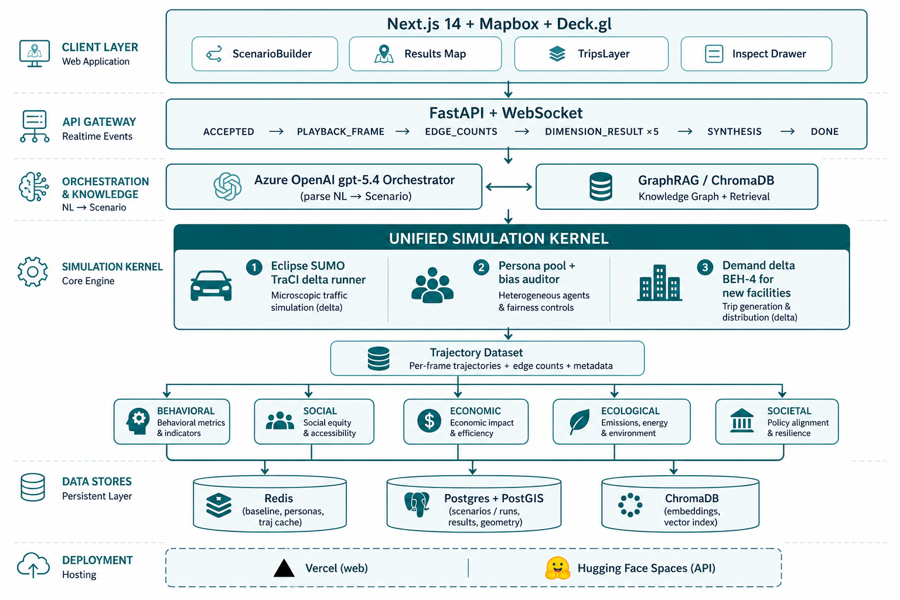
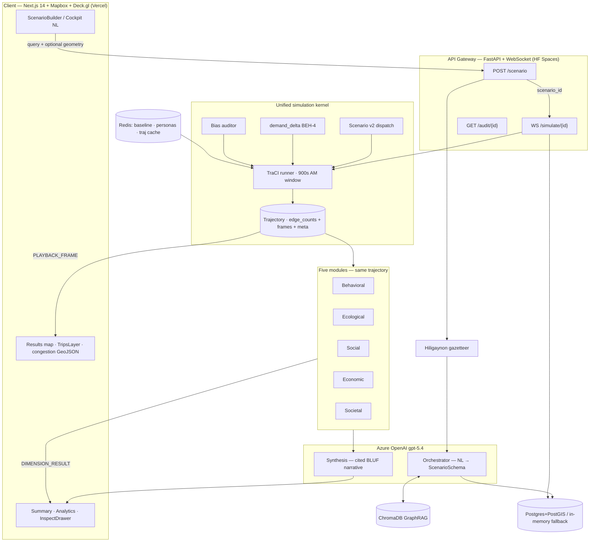
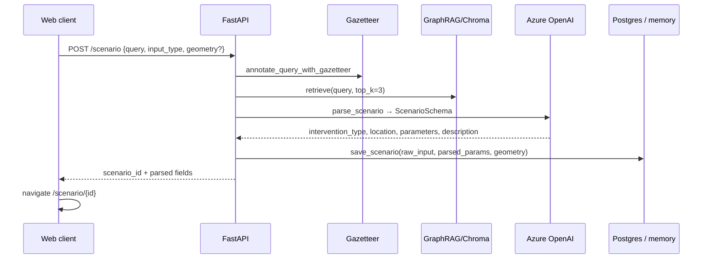
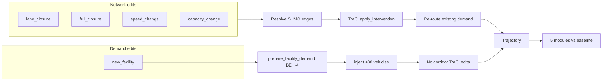
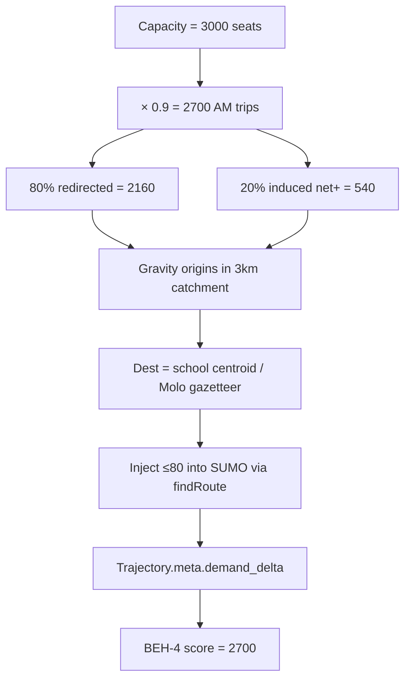
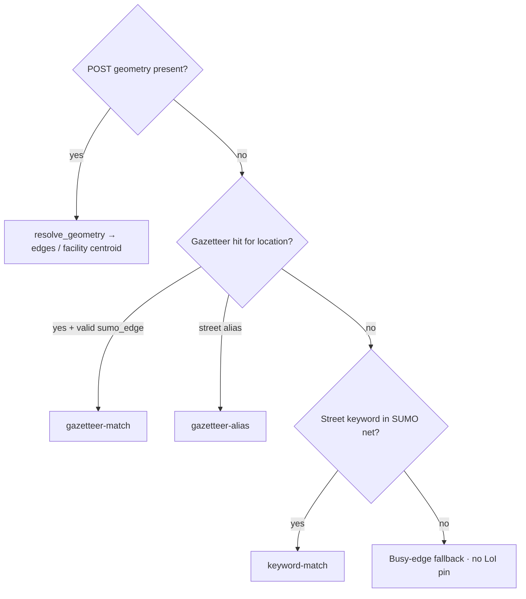
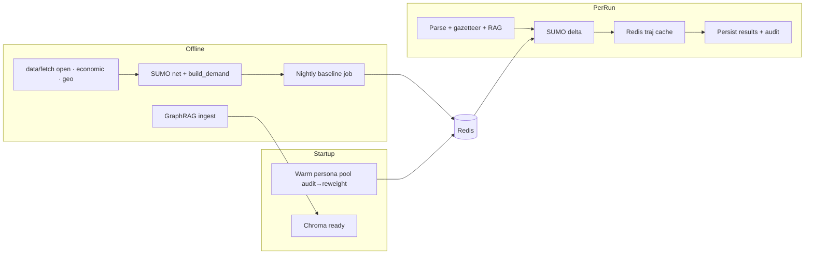

# MATRIX Architecture Canvas — As-Deployed

**Project:** MATRIX (Multi-Agent Twin for Routing & Infrastructure eXchange)  
**Status:** As-built reference (through CR-010 / CR-011)  
**Pilot:** Iloilo City  
**Interactive canvas:** [architecture-canvas-matrix.html](architecture-canvas-matrix.html)  
**Overview image:** 

> This document maps **what is actually deployed**: Vercel web + Hugging Face Spaces API (SUMO + Redis in Docker), Scenario v2 interventions, BEH-4 facility demand, and the live WebSocket contract. Spec companions: [sdd-matrix.md](sdd-matrix.md), [rfc-matrix-realtime-pipeline.md](rfc-matrix-realtime-pipeline.md), [methods-matrix.md](methods-matrix.md).

---

## 1. System architecture map



**Invariant:** one kernel → one trajectory → five modules. The LLM parses and narrates; it **never originates a number** (PRD-F14).

---

## 2. What happens when a user submits a scenario

### 2.1 Compose input

| Path | What the user does | What gets posted |
|------|--------------------|------------------|
| ScenarioBuilder | Pick intervention + location + params | Controlled NL: e.g. `Build a 3,000-seat school at Molo.` |
| Cockpit preset | Click “School in Molo” | Free NL: `What if we build a 3,000-seat school in Molo?` |
| Map use-location | Right-click map | Coords spliced into **NL text** (not structured GeoJSON in the live builder) |
| Structured geometry | `createScenario(query, geometry)` | `POST` body includes GeoJSON Point/Polygon |

**Intervention types:** `lane_closure` | `full_closure` | `speed_change` | `capacity_change` | `new_facility`  
**Facility kinds:** `school` (seat) | `market` (stall) | `terminal` (bay)

### 2.2 Parse & persist (`POST /scenario`)



### 2.3 Simulate stream (`WS /simulate/{id}`)

Live event contract in `matrix_api/main.py`:

```
ACCEPTED → [QUEUED] → PLAYBACK_FRAME* → EDGE_COUNTS → DIMENSION_RESULT×5 → SYNTHESIS → DONE
```

| Event | Drives |
|-------|--------|
| `ACCEPTED` | Run start |
| `QUEUED` | Concurrency gate (optional) |
| `PLAYBACK_FRAME` | Deck.gl `TripsLayer` agents `{id, lon, lat, mode}` |
| `EDGE_COUNTS` | Congestion layer + honest corridor / LoI / resolution label |
| `DIMENSION_RESULT` | Five cards with `equation_id`, `input_dataset_ids`, confidence |
| `SYNTHESIS` | Plain-language BLUF + citations |
| `DONE` | `duration_ms` + timings `{sumo_ms, modules_ms, llm_ms, total_ms}` |

**Trajectory resolution:** Redis `scenario:{id}:latest` → else live `simulate(Scenario)` → cache write-back (TTL ~7200s).

---

## 3. Simulation core — two families



### Road path
1. `_resolve_edges` / `resolve_intervention_site`
2. TraCI: `lane.setDisallowed` / `edge.setMaxSpeed` / per-lane speed × `capacity_factor` (honest proxy — SUMO cannot add lanes at runtime)
3. Modules score corridor Δtrips vs `baseline:iloilo:latest`

### Facility path
1. Site resolution returns `([], "facility-demand")`
2. `_apply_new_facility` records demand-only assumptions (no TraCI)
3. BEH-4 gravity trips → `inject_facility_demand` (cap **80**)
4. Behavioral exposes **BEH-4 = demand_trips_total**; other dims react to injected edge activity

**SUMO window:** default `SIM_END = 900` s (AM-peak slice).

---

## 4. School → `new_facility` → net+ traffic (BEH-4)

Classification:

```
"3,000-seat school in Molo"
  → intervention_type = new_facility
  → parameters.facility_kind = school
  → parameters.capacity = 3000
  → location ≈ "Molo" (gazetteer → lon/lat)
```

**Facility profiles** (`FACILITY_PROFILES` in `demand_delta.py`):

| Kind | Unit | trips_per_capacity | redirected_fraction | Catchment |
|------|------|--------------------|---------------------|-----------|
| school | seat | 0.9 | 0.8 | 3,000 m |
| market | stall | 1.2 | 0.6 | 2,000 m |
| terminal | bay | 4.0 | 0.7 | 5,000 m |

**Worked example — 3,000-seat school:**

```
demand_trips_total = round(3000 × 0.9) = 2700
n_redirected       = round(2700 × 0.8) = 2160   # retargeted existing travel
n_induced (net+)   = 2700 − 2160       =  540   # new trips in AM window
```

- Origins sampled with gravity \(d^{1-\beta}\), \(\beta=2.0\), ring 100–3000 m  
- Destination = facility centroid  
- Modes from `ILOILO_MODE_SHARE` (jeepney 50%, …)  
- SUMO injects ≤80 sample vehicles; UI BEH-4 still reports **2700**  
- Confidence **L** (provisional gravity → directional only)



---

## 5. Maps & location determination

### Map stack
- **Base:** Mapbox GL — default lon `122.56`, lat `10.72`, zoom 13, pitch 45°  
- **Clamp:** lng 122.48–122.62 · lat 10.64–10.79 · minZoom 11 (`scenarioMapConstants.ts`)  
- **Playback:** Deck.gl `TripsLayer` ← `PLAYBACK_FRAME`  
- **Congestion:** `public/layers/edges.geojson` keyed by `edge_id` ← `EDGE_COUNTS`  
- **Flood / static layers:** `public/layers/*.geojson`  
- **Pin / fly-to:** honest corridor midpoint, else `location_of_interest`  
- **Kernel OSM bbox:** `(10.65, 122.50, 10.78, 122.61)`

### Location resolution order



Facilities (`facility-demand`) skip corridor halo; camera uses gazetteer / map-drop LoI when available.

---

## 6. Data model (runtime)

### Kernel `Scenario`
```
scenario_id, description
corridor, lanes_closed          # v1 legacy (= lane_closure)
intervention_type, location
geometry: GeoJSON | null
parameters: dict                 # per-type knobs
```

### Persistence
| Table / store | Purpose |
|---------------|---------|
| `scenarios` | `raw_input`, `parsed_params`, `geometry`, `input_type` |
| `simulation_runs` | status, duration_ms, agent_count, baseline_id |
| `dimension_results` | score + confidence + equation_id + input_dataset_ids |
| `bias_audit_log` | mode-share vs Iloilo anchor, reweight flag |
| `Trajectory` | `edge_counts`, `frames`, `meta` (applied, demand_delta, LoI, resolution) |

### Parameters by type
| Type | Parameters |
|------|------------|
| `lane_closure` | `lanes_closed` (default 1) |
| `speed_change` | `max_speed_kph` (default 30) |
| `capacity_change` | `capacity_factor` (default 1.2) |
| `new_facility` | `facility_kind`, `capacity` (**required**, no silent default) |

---

## 7. Data pipeline & caches



| Redis key | Contents |
|-----------|----------|
| `baseline:iloilo:latest` | Nightly edge volumes |
| `personas:iloilo:v1` | Pre-warmed pool (+ audit sibling) |
| `scenario:{id}:latest` | Cached trajectory for repeat runs |

---

## 8. Key source files

| Concern | Path |
|---------|------|
| Scenario model + TraCI dispatch | `app/packages/kernel/matrix_kernel/scenario.py` |
| Facility demand BEH-4 | `app/packages/kernel/matrix_kernel/demand_delta.py` |
| SUMO injection cap | `app/packages/kernel/matrix_kernel/facility_injection.py` |
| Edge / site resolution | `app/packages/kernel/matrix_kernel/runner.py` |
| Orchestrator | `app/packages/kernel/matrix_kernel/orchestrator.py` |
| WS contract | `app/apps/api/matrix_api/main.py` |
| Builder NL grammar | `app/apps/web/src/components/ScenarioBuilder.tsx` |
| Map defaults | `app/apps/web/src/components/map/scenarioMapConstants.ts` |
| Gazetteer | `app/packages/kernel/matrix_kernel/gazetteer.py` |

---

## 9. One-page school run checklist

1. User: “What if we build a 3,000-seat school in Molo?”  
2. Gazetteer annotates Molo → GraphRAG chunks → LLM → `new_facility` / school / 3000  
3. Persist Scenario (`geometry=null`, location from parse)  
4. WS `ACCEPTED` → resolve facility lon/lat via gazetteer  
5. BEH-4: 2700 trips (540 net+) → inject ≤80 → stream frames  
6. `EDGE_COUNTS` → five `DIMENSION_RESULT`s → synthesis → `DONE`  
7. Map flies to Molo LoI; Inspect shows `equation_id=BEH-4`, confidence L  
