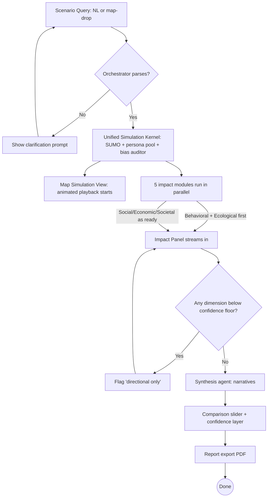

# Product Requirements Document (PRD)

**Project:** MATRIX — Multi-Agent Twin for Routing & Infrastructure eXchange (Simulator)
**Date:** 2026-06-02
**Version:** 0.1
**Owner:** Carlos Jerico Dela Torre (Team ATLAN, Polytechnic University of the Philippines)
**Status:** Locked — 2026-06-03 (Phase 0; changes require a Change Record per [index.md](index.md) §2)
**Last reconciled:** N/A — not yet reconciled with code
**BRD:** N/A — business case is carried by [MATRIX.md](../MATRIX.md) §1–3 and Appendix B

> **Source of truth:** [MATRIX.md](../MATRIX.md) is canonical; this PRD decomposes it into spec form. Data backing: [../data/READINESS.md](../data/READINESS.md) (per-dimension availability + confidence) and [../data/INVENTORY.md](../data/INVENTORY.md).

---

## 1. Product Purpose & Value Proposition

MATRIX is a **pre-construction infrastructure impact simulator**. A planner, developer, or LGU officer drops a proposed project onto a simulator of their city (or asks in plain language — "what happens if we build a 3,000-seat school here?"), and within ninety seconds MATRIX runs thousands of multi-agent simulations and returns scored, calibrated impact across five dimensions — **Behavioral, Social, Economic, Ecological, Societal** — each with an explicit confidence level. The user watches the simulation animate on the map, reads dimension-specific narratives generated by Gemini 3.1, and exports a recommendation report. Unlike specialist tools (PTV Vissim, Aimsun, ESRI CityEngine, Replica) that optimize one dimension or require a transport engineer / GIS specialist, MATRIX is the first to give a **non-technical planner a confidence-anchored, five-dimensional answer to a natural-language question** — honestly bounded (ranges, not false precision), with a transparent bias auditor. **MATRIX is a glass box, not a black box** — every number is derived by an explicit equation from named open data, carries a computed confidence tier, and is reproducible and citable ([methods-matrix.md](methods-matrix.md)). Pilot city: **Iloilo**.

---

## 2. Target Personas

**Primary Persona — LGU Planner (Iloilo CPDO / NEDA VI / DOTr VI / LTFRB VI)**
- *Who they are:* A city planning & development officer who evaluates infrastructure proposals and prioritizes capital projects. Comfortable with maps and feasibility reports; **not** a simulation modeler or data scientist.
- *Their core frustration:* Static feasibility studies age the day they're filed; cross-domain impacts (transport, environment, economy, social equity) are evaluated in separate offices and only collide after approval; existing simulation tools require specialists they don't have.
- *What success looks like:* Ask a plain-language "what if" and receive a defensible, confidence-bounded five-dimension answer with evidence — enough to back an Environmental Impact Assessment or a capital-prioritization decision.

**Secondary Persona — Developer / Master Planner (Megaworld Iloilo Business Park, Ayala Land)**
- *Who they are:* Site-selection and master-planning teams deciding building placement, entrances, parking.
- *Their core frustration:* Community pushback and displacement effects surface only at public consultation; pedestrian-flow and footfall studies use tiny samples.

**Tertiary Persona — Civic / Academic Stakeholder (UP Visayas SURP, Clean Air Asia, ICLEI)**
- *Who they are:* Researchers and advocates who need independent, simulation-backed verification of impact claims. *(Not a v1 priority driver, but shapes the open-methodology + audit-log requirements.)*

---

## 3. Core Features & Priorities

Feature IDs are permanent. Priorities mirror MATRIX.md §9 feature tiers (Tier 1 → Must, Tier 2 → Should, Tier 3 → Could/Won't-v1).

| ID | Feature | Description | Priority |
|----|---------|-------------|----------|
| PRD-F1 | **Unified simulation kernel** | One SUMO + LLM-persona run produces a single per-agent trajectory dataset; all impact modules score the *same* simulated reality (no cross-dimension contradictions). | Must-Have |
| PRD-F2 | **NL + map-drop scenario input** | Gemini 3.1 orchestrator parses a natural-language query or a map-placed project into a simulation plan. | Must-Have |
| PRD-F3 | **Five impact modules** | Behavioral, Social, Economic, Ecological, Societal modules consume the trajectory dataset and emit dimension-specific scores. | Must-Have (Behavioral + Ecological first) |
| PRD-F4 | **Real-time interactive visualization** | Next.js + Deck.gl TripsLayer animated agent playback on a Mapbox base, end-to-end within a 90-second budget. | Must-Have |
| PRD-F5 | **Confidence-anchored outputs** | Every dimension reports a High/Medium/Low confidence and ranges (not point estimates); a translucent confidence layer shows where data is weaker. | Must-Have |
| PRD-F6 | **Bias auditor** | Persona generation constrained to Iloilo ground-truth mode share (±3% triggers reweight); runs after every persona batch; public audit log. | Must-Have |
| PRD-F7 | **Synthesis + recommendation report** | Gemini 3.1 Pro generates per-dimension narratives and an exportable PDF report with assumptions and confidence intervals. | Should-Have |
| PRD-F8 | **Comparison slider** | Drag to compare baseline vs scenario states. | Should-Have |
| PRD-F9 | **GraphRAG knowledge base** | ChromaDB + GraphRAG over OSM/PSA/CLUP/literature for retrieval-grounded orchestration and synthesis. | Should-Have |
| PRD-F10 | **PWA companion (GPS traces)** | Mobile-first opt-in collection of cyclist/jeepney-rider traces to refine behavioral calibration. | Could-Have |
| PRD-F11 | **Bilingual prompting** | Persona prompts in English + Filipino + Hiligaynon to surface vernacular decision logic. | Could-Have |
| PRD-F12 | **Multi-city scaling demo** | Swap OSM bbox + reweight persona archetypes for one additional ASEAN city (Jakarta/Bangkok). | Could-Have |
| PRD-F14 | **Glass-box traceability** | Every output drills down to its number, equation, data source, references, assumptions, and confidence — no black box. Backed by [methods-matrix.md](methods-matrix.md). | Must-Have |
| PRD-F15 | **Earned-confidence ensemble** | Monte-Carlo / sensitivity over uncertain assumptions → the confidence *range* is computed, not just labeled. | Must-Have |
| PRD-F16 | **Multi-alternative comparison & ranking** | Compare 2–3 candidate sites/designs and rank them — decision support, not single-scenario. | Should-Have |
| PRD-F17 | **Distributional equity output** | Who gains/loses by income decile & barangay (CCHAIN Relative Wealth Index). | Should-Have |
| PRD-F18 | **Validation & calibration** | Back-test vs Calderon 2014 BRT (RMSE) + 2024 Iloilo flood; surfaced in-product. | Should-Have |
| PRD-F19 | **Compound-shock resilience scenarios** | "Project + 25-year flood" using NOAH/LiPAD hazard layers. | Could-Have |
| PRD-F13 | **Voice input · public read-only API · AI-suggested scenarios · federated learning** | Tier-3 stretch capabilities. | Won't-Have (v1) |

---

## 4. User Stories & Acceptance Criteria

**US-01 — Natural-language scenario → five-dimension answer** *(PRD-F2, F3, F5)*
> As an **LGU planner**, I want to ask "what happens if we build a 3-story school in Mandurriao?" so that I get a calibrated cross-domain impact read without a specialist.

- Given a valid NL query about a location in the Iloilo simulator, when I submit it, then the orchestrator returns a parsed scenario plan and triggers a simulation within the latency budget.
- Given a completed simulation, when results render, then each of the five dimensions shows a score **and** an explicit High/Medium/Low confidence with a range (never a bare point estimate).

**US-02 — Map-drop scenario** *(PRD-F2, F4)*
> As a **developer**, I want to drop a proposed building footprint on the map so that I can test placement options visually.

- Given the map simulator, when I place/move a project geometry, then the scenario input updates and can be (re)simulated as a delta against the nightly baseline.

**US-03 — Watch the simulation play out** *(PRD-F4)*
> As any user, I want to see agents animate along corridors so that the result is legible and trustworthy.

- Given a running/completed simulation, when playback starts, then animated agent trajectories render on the Deck.gl TripsLayer while later modules are still streaming in (progressive UI).
- Given the 90-second budget, when the pipeline runs for a single-user demo scenario, then Behavioral + Ecological return first and all five complete within budget (target; see §8 assumptions).

**US-04 — See where the model is unsure** *(PRD-F5)*
> As an LGU planner, I want low-confidence dimensions flagged so that I don't over-trust a number.

- Given any dimension below the confidence threshold, when results render, then it is labeled "directional only" and visibly de-emphasized rather than shown as precise.

**US-05 — Compare baseline vs scenario** *(PRD-F8)*
- Given a baseline and a scenario, when I drag the comparison slider, then the map and per-dimension deltas update in sync.

**US-06 — Export a recommendation report** *(PRD-F7)*
- Given a completed run, when I export, then I receive a PDF with the five-dimension results, confidence intervals, assumptions, and data sources.

**US-07 — Inspect the bias audit log** *(PRD-F6)*
- Given a persona batch, when the bias auditor runs, then the resulting mode-share vs ground-truth comparison is recorded in a publicly viewable audit log; deviations beyond ±3% are shown as having triggered reweighting.

---

## 5. App Flow & UX Intent

**Design reference:** DSD not yet written — see `dsd-matrix.md` (planned). Visual stack: Next.js 14 + Tailwind + shadcn/ui; Mapbox GL JS + Deck.gl.

### 5.1 Screen Inventory

| Screen | Purpose | Entry points | States to design |
|--------|---------|--------------|------------------|
| Scenario Query | NL input + map entry to define a scenario | app launch, "new scenario" | empty / typing / parsing / error (unparseable) |
| Map Simulation View | Animated agent playback + toggleable impact/confidence layers | after submit | loading / streaming / playing / error |
| Impact Panel (5 dimensions) | Per-dimension scores, ranges, confidence | alongside map | streaming (per-dimension) / complete / directional-only |
| Comparison View | Baseline vs scenario slider | from results | baseline / scenario / mid-drag |
| Bias Audit Log | Mode-share anchor vs ground truth, reweight events | from results / footer | empty / populated |
| Report Export | Generate + download PDF recommendation | from results | idle / generating / ready / error |

*Every interactive screen defines empty / loading / error / success — not just the happy path.*

### 5.2 App Flow

**Linear (primary path):**

`Scenario Query → (orchestrator parses) → Map Simulation View (playback begins) → Impact Panel streams 5 dimensions → Comparison + Confidence layers → Report Export`

**Branching (Mermaid):**

**Flow annotations:**

| Flow concern | Detail |
|--------------|--------|
| Entry points | App launch; "new scenario"; map-drop of a project geometry |
| Decision branches | parse success?; per-dimension confidence-floor check; baseline-exists? (delta vs cold run) |
| Dead ends | none — unparseable input returns to Query with a clarification prompt |
| Abandonment / exit | closing mid-run preserves the last completed baseline; scenario can be re-run |
| Edge cases | data-sparse barangay (low confidence); SUMO/network gap; Gemini unavailable (see §7 fallback); multi-user load (queue) |

### 5.3 Onboarding Flow

- **Aha / first-value moment:** the user's first scenario returns an **animated, five-dimension, confidence-tagged result** on the map.
- **Time-to-first-value target:** < 2 minutes (one canned reference scenario pre-loaded).
- **Skippable / resumable:** N/A — single primary surface; reference scenarios act as a guided start.
- **Friction budget:** no signup required for the demo; pick a reference scenario or type a query immediately.

### 5.4 UX Constraints

- **90-second end-to-end latency budget** is a product constraint, not an aspiration (MATRIX.md §5.2). Hit it via pre-warmed persona pool, delta simulations vs a nightly baseline, parallel modules, and streaming/progressive UI.
- **Confidence is always visible** — no dimension renders without its H/M/L tag.
- **Map-first, mobile-responsive** dashboard.

### 5.5 Instrumentation & Event Taxonomy

| Event name | Fires when | Key properties | Feeds metric |
|------------|-----------|----------------|--------------|
| `scenario_submitted` | user submits NL/map scenario | scenario_type, location, ts | usage / funnel |
| `simulation_completed` | kernel finishes a run | duration_ms, agent_count, delta_vs_baseline | 90s-budget SLO |
| `dimension_streamed` | a module returns | dimension, confidence, latency_ms | per-dimension latency |
| `bias_audit_logged` | auditor finishes a persona batch | mode_share_delta, reweighted(bool) | fairness audit |
| `report_exported` | PDF generated | dimensions_included, ts | activation |

**Naming convention:** snake_case `object_action`, past tense, no PII in properties. **Analytics tool:** TBD (lightweight for hackathon; Supabase events table acceptable).

---

## 6. Out of Scope for This Release

- Voice input (Filipino/English/Hiligaynon) — Tier 3, deferred.
- Public read-only replication API — Tier 3, deferred.
- AI-suggested "what-if" scenarios — Tier 3, deferred.
- Federated cross-city learning — documented as architecture only, not built.
- Live multi-city production (beyond a single scaling *demo*) — post-hackathon.
- Embedded conversational chat over results — deferred.

*Everything above was discussed and explicitly cut from v1 to protect the 90-second, five-dimension core.*

---

## 7. AI / Agent Feature Specifications

**AI Components:** (1) Orchestrator/Synthesis, (2) Persona generator, (3) Bias auditor, (4) Baseline forecaster.
**Models considered:** Gemini 3.1 Pro / Flash-Lite; (rejected) Gemini 1.5 (shut down) and 2.0 (shut down 2026-06-01, before final submission).
**Selected models:**
- **Gemini 3.1 Pro** — NL scenario parsing, orchestration, synthesis/report narratives. *Reason: current-generation reasoning; needed for reliable NL→plan and grounded narrative.*
- **Gemini 3.1 Flash-Lite** — high-volume persona generation. *Reason: free-tier covers prototype-scale persona batches.*
- **XGBoost** — corridor-volume baseline forecaster. **Eclipse SUMO** (via TraCI) — the physical agent kernel (not an LLM; chosen over OASIS/MiroFish, which simulate social-media dynamics, not urban agents).

**What the AI does:** parses the scenario → plans a SUMO run → generates a calibrated commuter-persona pool → (modules score the run) → synthesizes per-dimension narratives + a recommendation, each tagged with confidence.

**Input → Output contract:**
- Input: NL query or map geometry + scenario parameters.
- Output: structured per-dimension scores with confidence + ranges, an animated trajectory dataset, and a narrative report.
- Latency expectation: 90 s end-to-end (single-user); see budget breakdown in MATRIX.md §5.2.

**Human-in-the-loop points:**
- Low-confidence dimensions are surfaced as "directional only," not auto-trusted.
- Bias-auditor reweighting is logged and publicly inspectable.

**Fallback behavior when AI fails or is unavailable:**
- Persona pool is **pre-warmed and cached** — user input reweights, it does not regenerate; a nightly **baseline** run exists, so a scenario can fall back to baseline + delta.
- If a dimension lacks data, it returns **"Low confidence — directional only"** rather than a fabricated number.

**Token / cost budget per operation:** Flash-Lite (free tier) absorbs high-volume persona work; Pro is reserved for orchestration + synthesis only (low call count). Persona pool cached, not regenerated per run.

---

## 8. Dependencies & Assumptions

**Dependencies:**
- Gemini 3.1 API access (Google AI Studio key) — required for the build, not for these docs.
- Open Iloilo data per [../data/INVENTORY.md](../data/INVENTORY.md) — OSM, Project CCHAIN (barangay-level), Overture, LPTRP routes, literature — already acquired and Iloilo-subset.
- Eclipse SUMO, OSMnx, Deck.gl/Mapbox, FastAPI/WebSocket, Supabase, ChromaDB/GraphRAG, Redis.

**Assumptions:**
- **Single-user demo load** for the 90-second budget; multi-user requires queueing (acceptable for hackathon scope).
- **Open data is sufficient** to build all five dimensions (validated in [../data/READINESS.md](../data/READINESS.md)); FOI/outreach items are fidelity upgrades, not blockers.
- **Mode-share calibration** is derived from literature (Calderon 2014 + Iloilo studies), not a live travel survey — carried at **Medium** confidence and enforced by the bias auditor's mode-share anchor.
- Economic is the thinnest dimension until BIR zonal / establishment data lands (in progress) — until then it carries a Low–Medium confidence floor.

---

## 9. Implementation Plan

Derived from MATRIX.md §8 (aggressive hackathon roadmap, May 15 – June 20, 2026).

| # | Phase / Milestone | Entry criteria | Exit criteria (DoD) | Deliverable | Depends on | Owner (DRI) | Top risk |
|---|-------------------|----------------|---------------------|-------------|------------|-------------|----------|
| M1 | Foundation, data, Iloilo simulator (Sprint 1) | team committed to Iloilo | OSM→SUMO simulator renders; data acquired; skeleton runs end-to-end with stubs | Iloilo SUMO network + data pipeline | — | Data + Infra leads | data gaps (mitigated — see READINESS) |
| M2 | Core engine + first dimensions (Sprint 2) | M1 simulator + kernel | Behavioral + Ecological return scored impact; WebSocket→Deck.gl playback | 2-dimension live demo | M1 | Sim + Frontend | latency creep |
| M3 | Remaining dimensions + full UI (Sprint 3) | M2 pipeline | all 5 dimensions scored; NL orchestration end-to-end; comparison + confidence layers | Five-dimension build | M2 | Per-module devs | cross-dimension consistency |
| M4 | Hardening + validation (Sprint 4) | M3 feature-complete | 8 reference scenarios; validation vs Calderon 2014 (RMSE); 90 s budget locked | Production-quality build | M3 | Whole team | 90 s budget under load |
| M5 | Polish, pitch, submission (Sprints 5–6) | M4 build | all final deliverables 48 h before deadline; public repo + demo URL | Submission package | M4 | Lead | demo fragility |
| M6 | Post-submission / semis | Top 20 | live-demo rehearsal w/ backup scenarios; fidelity upgrades (outreach) | Semi-final demo | M5 | Lead | live-demo risk |

**Rollout strategy:** big-bang **hackathon submission** (single public demo URL + repo) → phased hardening post-hackathon. *Reason: fixed competition deadline; no production user base at submission.*

**Rollback plan:**
- *Trigger criteria:* demo-blocking failure (kernel/Gemini outage, latency blowout) during a live session.
- *Revert mechanism:* fall back to the **last-good tagged build** serving **pre-computed reference scenarios** off the nightly baseline; degrade gracefully to "directional only" rather than erroring.

**RFC cross-reference:** the simulation kernel and the 90-second streaming pipeline are the two areas with real architectural trade-offs → candidate RFCs (see SDD next).

---

## 10. Team & Ownership (5-person team)

Canonical owner map (refines the DRIs in §9; referenced by SAD/BUILD/OPS/GTM). **Team Lead: Carlos Jerico Dela Torre.**

| Member | Role | Owns |
|---|---|---|
| **Carlos Jerico Dela Torre** — *Team Lead* | AI & Software Development · Product & Business Architecture | architecture + AI orchestration/synthesis (F2/F6/F7/F9/F14), kernel, glass-box; PRD/BRD, PM, pitch |
| **Yushin Bjorn Matsuda** | AI & Software Development · UI/UX Design | the build with Jerico (kernel, 5 modules, backend) + frontend & 3D viz (F4/F8/F16), Inspect UI |
| **Maria Espina** | QA · UI/UX Design | UI/UX design (DSD) with Yushin; QA / release gates |
| **Rica Mae Mago** | QA · Research & Marketing | QA; research (data/literature/validation); marketing (GTM, pitch, video) |
| **Russell Jay Fajardo** | QA · Research & Marketing | QA; research; marketing (GTM, pitch, video) |

**By function:** **AI & Software Dev** → Jerico (lead) + Yushin (kernel, modules, AI, backend) · **UI/UX** → Yushin (build) + Maria (design) · **QA** → Maria + Rica + Russell (own the QAD happy/sad/abuse + glass-box + validation gates) · **Research & Marketing** → Rica + Russell (data/literature research, GTM, pitch deck, demo video) · **Product / Architecture / Lead** → Jerico.

**Milestone DRIs (refines §9):** M1 data+simulator — Jerico/Yushin (build) + Rica/Russell (data research) · M2 kernel+playback — Jerico/Yushin · M3 modules+UI — Jerico/Yushin (build), Maria (UX) · M4 validation+perf — QA (Maria/Rica/Russell) + Jerico/Yushin · M5 pitch/video/polish — Rica/Russell (marketing), Maria/Yushin (UI), Jerico (lead) · M6 semis — Jerico.

**RACI:** the function owner is **Responsible**; **Jerico is Accountable** (lead); the cross-cutting invariants — **glass-box, the 90 s budget, confidence tiers** — are all-hands **Consulted**; **QA (Maria/Rica/Russell) signs off the release gates** ([QAD](qad-matrix.md) §6/§8).

---

## Self-Check

- [x] Every Must-Have feature (F1–F6) has at least one user story (US-01…US-07).
- [x] Acceptance criteria are testable (Given/When/Then).
- [x] §5.1: every interactive screen defines empty/loading/error/success.
- [x] §5.2: flow annotated for entry, exit, edge cases; no unintended dead ends.
- [x] §5.5: key metrics have feeding events (90 s SLO, per-dimension latency, fairness audit).
- [x] §6 explicitly names cut scope.
- [x] §7 filled (AI is central).
- [x] §9 covers through post-launch with rollout + rollback trigger/mechanism + DRIs.
- [x] This doc answers *what*, not *how* — architecture goes in `sdd-matrix.md`.
- [ ] Reconcile with code once the monorepo scaffold exists (Last reconciled → set then).
