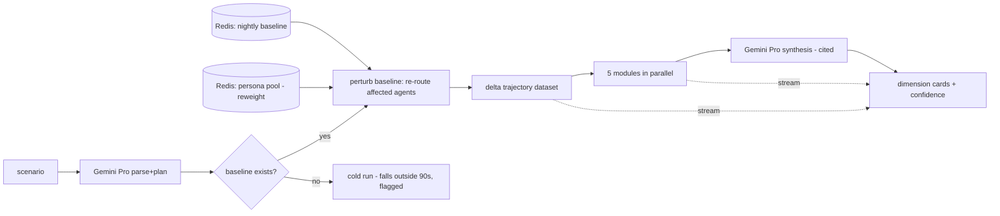

# Request for Comments (RFC) / Tech Spec

**Title:** Real-Time Simulation Pipeline — hitting the 90-second budget
**Date:** 2026-06-02
**Author:** Jerico (Team ATLAN)
**Status:** `Approved` (solo-operator: author = reviewer)
**Last reconciled:** N/A — not yet reconciled with code
**PRD Reference:** [prd-matrix.md](prd-matrix.md) §5.4, `PRD-F1`, `PRD-F4`
**SDD Reference:** [sdd-matrix.md](sdd-matrix.md) §2, §7
**RFC ID:** `matrix-rfc-001`

> One RFC for the project's central architectural bet. The kernel + the 90 s pipeline are inseparable, so they're specced together. Owners per [PRD §10](prd-matrix.md): **Jerico + Yushin** (AI & software dev — kernel, delta pipeline, streaming, UI); **Maria** (UI/UX); release gates by QA (**Maria/Rica/Russell**).

---

## 1. Context & Objective

**The problem this solves:** deliver a full **five-dimension, animated, glass-box** result for a user-defined scenario in **≤ 90 s end-to-end, single-user** — the live judging moment (Option C). A naïve full re-simulation per scenario blows this by minutes: a city-scale SUMO run plus regenerating thousands of LLM personas is the wrong order of magnitude.

**Implements:** the unified kernel (`PRD-F1`), real-time visualization (`PRD-F4`), and the SDD §7 latency NFR.

**Success criteria:**
- End-to-end ≤ 90 s; first dimension (Behavioral/Ecological) streamed ≤ ~65 s; playback first frame early.
- Every streamed number carries provenance (`equation_id` + `dataset_ids` + confidence) — glass-box (`PRD-F14`).
- Reproducible: same scenario + seed + data/model versions → identical output.

---

## 2. Proposed Solution

Four levers (MATRIX.md §5.2), composed:

1. **Pre-warmed persona pool** — 200–500 commuter personas generated once at startup (Flash-Lite) and cached in Redis. A scenario **reweights** archetype mix; it does not regenerate.
2. **Delta simulation vs a nightly baseline** — a full baseline trajectory is computed nightly and cached. A scenario applies a **perturbation** (drop the project geometry → re-route only the affected agents/corridors) and computes the **difference**, not a fresh city-wide run.
3. **Parallel modules on one trajectory dataset** — the five impact modules consume the *same* delta trajectory concurrently (no cross-dimension contradiction; `PRD-F1`).
4. **Streaming / progressive UI** — results stream over WebSocket as each stage completes; playback animates while later modules still compute.

**Latency budget:** parse 0–5 s · GraphRAG retrieve 5–15 s · SUMO delta 15–60 s · 5 modules (parallel) 60–80 s · synthesis 80–90 s.



**Architecture changes (all within SDD §2):** a nightly **baseline job**; Redis keys for **persona pool** + **baseline trajectory**; a **WebSocket streaming protocol** (below); a **parallel module executor**; `run_trace` logging for glass-box.

---

## 3. Technical Details & Contracts

### Data Model Changes
No new tables beyond the SDD. Uses `simulation_runs.baseline_id` (delta source), streamed `dimension_results` (+ provenance columns), `run_trace`, and Redis caches (`persona_pool:v{n}`, `baseline:{date}`). *No schema changes required.*

### API / WS Contract
`WS /simulate/{scenario_id}` — server streams newline-delimited JSON events:

```
event RUN_PLAN        {plan, baseline_id, seed}
event PLAYBACK_FRAME  {tick, agents:[{id, lon, lat, mode}]}        # during SUMO; drives TripsLayer
event DIMENSION_RESULT {dimension, score, range:[lo,hi], confidence:"H|M|L",
                        directional:bool, equation_id, input_dataset_ids:[...], references:[...]}  # one per module as it finishes
event SYNTHESIS       {narrative, citations:[{claim, equation_id, dataset_ids}]}
event RUN_FINISHED    {duration_ms, seed, dataset_versions}
event ERROR           {stage, message, fallback:"baseline|directional|retry"}
```

**Delta mechanism:** `scenario_trajectory = baseline_trajectory ⊕ perturbation(project_geometry)`. The perturbation re-routes only agents whose path intersects the project's impact buffer; unaffected agents are inherited from baseline. Modules score the delta.

### State Management
Client consumes the WS via a store; **progressive render** — playback starts on the first `PLAYBACK_FRAME`; each Dimension Card fills on its `DIMENSION_RESULT`; the confidence layer reads `confidence`/`directional`. No polling.

---

## 4. Alternatives Considered

| Option | Why Rejected |
|--------|-------------|
| Full re-simulation per scenario | City-scale SUMO + persona regen = minutes; blows the 90 s budget by an order of magnitude |
| Async / batch (return results later) | Kills the real-time judging moment (Option C); the animated playback is the differentiator |
| Pure-LLM "simulate the city" (no SUMO) | **Black box** + non-reproducible + slow; the numbers wouldn't be traceable — violates the glass-box mandate (`PRD-F14`) |
| Regenerate personas per scenario | Gemini latency + cost; defeated by pre-warm + reweight |
| Sequential module execution | ~5× module time; blows budget; parallel on one dataset is both faster and consistency-preserving |

---

## 5. AI / Agent Implementation Notes

**Models:** Gemini 3.1 Pro (parse + synthesis), Flash-Lite (persona pool, cached). **Glass-box constraint:** synthesis claims that assert a number must cite an `equation_id` + `dataset_ids`; the numbers come from the kernel/equations, never the LLM (see [methods-matrix.md](methods-matrix.md) §4 citation guard). **Prompt strategy:** cached static system prefix (Iloilo context + mode-share anchors). **Edge cases:** unparseable scenario → clarification, no run; data-sparse dimension → `directional:true`; Gemini 429 → backoff + cached parse for reference scenarios. **Token budget:** persona work on Flash-Lite free tier (cached); Pro low call count (1 parse + 1 synthesis/run).

---

## 6. Security, Privacy & Performance

- **Security:** scenario text is untrusted → structured-plan parse only, no free-form execution (SDD §8.1 LLM01); WS keyed by scenario_id; scenario submission rate-limited to protect the Gemini budget.
- **Performance:** delta keeps SUMO in the 15–60 s band; parallel modules in 60–80 s. **90 s holds for single-user; multi-user → queue (deferred debt).** Cold run (no baseline) is flagged as outside-budget, not hidden.
- **Privacy:** no PII (open/aggregated data; synthetic personas). PWA traces are a separate, consented surface (CLR).

---

## 7. Execution Plan

**Feature flag:** `USE_BASELINE_DELTA=true` (falls back to cold run if false/missing baseline).

| Ticket | Description | Owner (§10) | Size |
|--------|-------------|-------------|------|
| `RT-01` | Nightly baseline job + Redis cache | Jerico/Yushin | S |
| `RT-02` | Persona pool pre-warm + reweight | Jerico/Yushin | M |
| `RT-03` | Delta perturbation in SUMO/TraCI (affected-agent re-route) | Jerico/Yushin | L |
| `RT-04` | WebSocket streaming protocol + FastAPI gateway | Yushin | M |
| `RT-05` | Parallel module executor over the trajectory dataset | Jerico/Yushin | M |
| `RT-06` | Progressive UI render (playback + streaming dimension cards) | Yushin | M |
| `RT-07` | 90 s budget perf harness (QAD `PERF-01`) | Yushin + QA | S |

**Rollout order:** baseline job → persona pool → delta kernel → WS gateway → parallel modules → progressive UI → perf-lock. **Maps to PRD §9 milestones M2–M4.**

---

## Self-Check

- [x] §3 states "no schema changes" (reuses SDD tables) and gives exact WS event shapes.
- [x] §4 has real rejected alternatives (full rerun, pure-LLM, async), not strawmen.
- [x] §5 filled (AI is central); glass-box citation constraint stated.
- [x] §7 tickets are actionable, owned per §10, and mapped to PRD milestones.
- [x] Nothing duplicates PRD features or SDD global architecture — this is the *how* of the 90 s bet only.
