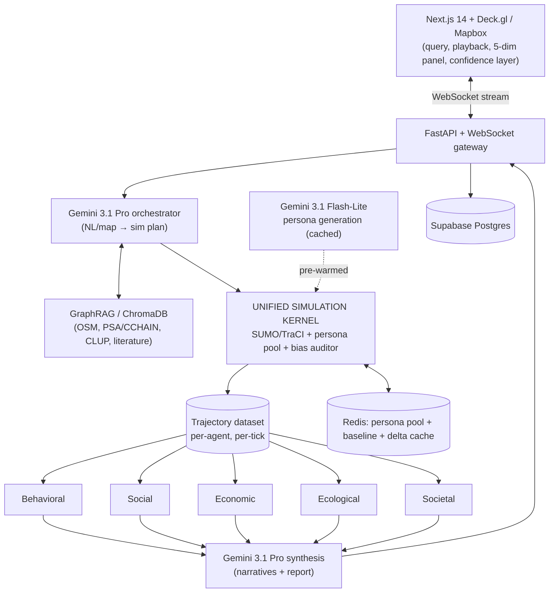

# System Design Document (SDD)

**Project:** MATRIX — Multi-Agent Twin for Routing & Infrastructure eXchange
**Date:** 2026-06-02
**Version:** 0.1
**Owner:** Carlos Jerico Dela Torre (Team ATLAN)
**Status:** Draft
**Last reconciled:** N/A — not yet reconciled with code
**PRD:** [prd-matrix.md](prd-matrix.md)

> Architecture for the PRD's features (`PRD-F#`). Locked technical decisions come from [MATRIX.md](../MATRIX.md) §5–6; data availability/confidence from [../data/READINESS.md](../data/READINESS.md). Treat the locked stack as invariant unless explicitly reopened.

---

## 1. Architectural Vision & Principles

**Architecture style:** **One unified simulation kernel feeding five impact modules** — a Python simulation/compute core (Eclipse SUMO + LLM-persona pool + bias auditor) behind a FastAPI/WebSocket gateway, streaming to a Next.js + Deck.gl client. Compute is delta-based and pre-warmed to hit a hard latency budget.

**Guiding principles:**
- **One kernel, one trajectory dataset (`PRD-F1`).** All five modules score the *same* simulated reality — this is the architectural reason results never contradict across dimensions. Never fork into five independent simulators.
- **Confidence is first-class (`PRD-F5`).** Every output carries High/Medium/Low + a range; anything below the floor renders "directional only," never as precision.
- **Deterministic where it counts.** SUMO + Python do the physics and scoring; Gemini orchestrates and narrates, constrained by the bias auditor (`PRD-F6`). LLMs decide and describe; they do not invent the numbers.
- **Pre-warm + delta to hit 90 s.** Cached persona pool + nightly baseline + parallel modules + streaming/progressive UI (MATRIX.md §5.2).

**Key trade-offs (explicit V1 debt):**
- 90-second budget holds for **single-user**; multi-user needs a queue (deferred — acceptable for hackathon).
- **Delta-vs-baseline** assumes a valid nightly baseline exists; a cold/no-baseline run is slower (falls outside budget — documented).
- **Open-data confidence floors:** mode-share calibration is literature-derived, not a live travel survey → Behavioral calibration carried at Medium; Economic at Low–Medium until BIR/establishment data lands.

---

## 2. High-Level Architecture

**Layers:**

| Layer | Technology | Responsibility |
|-------|------------|----------------|
| Client | Next.js 14 (App Router) + Tailwind + shadcn/ui; Mapbox GL JS + Deck.gl (TripsLayer) | Scenario input (`PRD-F2`), animated playback (`PRD-F4`), 5-dim panel + confidence layer (`PRD-F5`), comparison slider (`PRD-F8`) |
| API / Gateway | FastAPI + WebSocket | Accept scenarios, stream simulation + per-dimension results progressively |
| Service / Compute | Python: SUMO via TraCI (kernel, `PRD-F1`); persona generator (Gemini Flash-Lite); 5 impact modules (`PRD-F3`); bias auditor (`PRD-F6`); XGBoost baseline forecaster | Run the physics, generate/score the trajectory dataset, audit bias |
| Data | Supabase Postgres (run metadata/results/audit), ChromaDB (vectors, `PRD-F9`), Redis (persona pool + baseline + delta cache) | Persistence, retrieval, hot caches |
| Infrastructure | Vercel (frontend) + Fly.io (FastAPI + SUMO Docker + workers) + Redis + Supabase | Hosting, scaling, the SUMO container |

---

## 3. Data Architecture

**Primary database:** Supabase Postgres — *run metadata, scenarios, per-dimension results, bias audit log; managed Postgres with auth/storage we can grow into.*
**Secondary / cache:** Redis — *pre-warmed persona pool, the nightly baseline trajectory, and scenario delta cache; the latency budget depends on these being hot.*
**Vector store:** ChromaDB (embeddings via `bge-small-en`) — *GraphRAG over OSM/PSA-CCHAIN/CLUP/literature for grounded orchestration + synthesis (`PRD-F9`).*

### Backend Schema

**Table: `scenarios`**

| Column | Type | Null? | Default | Key / Index | Constraint |
|--------|------|-------|---------|-------------|------------|
| `id` | UUID | No | gen_random_uuid() | PK | — |
| `input_type` | TEXT | No | — | — | CHECK in ('nl','map') |
| `raw_input` | TEXT | No | — | — | the NL query or map action |
| `parsed_params` | JSONB | Yes | — | — | orchestrator output (project type, location, size) |
| `geometry` | GEOMETRY | Yes | — | GIST idx | project footprint (PostGIS) |
| `created_at` | TIMESTAMPTZ | No | now() | — | — |

**Table: `simulation_runs`**

| Column | Type | Null? | Default | Key / Index | Constraint |
|--------|------|-------|---------|-------------|------------|
| `id` | UUID | No | gen_random_uuid() | PK | — |
| `scenario_id` | UUID | No | — | FK → `scenarios.id` | ON DELETE CASCADE |
| `baseline_id` | UUID | Yes | — | FK → `simulation_runs.id` | delta source |
| `status` | TEXT | No | 'queued' | idx | queued/running/streaming/done/failed |
| `duration_ms` | INT | Yes | — | — | for the 90 s SLO |
| `agent_count` | INT | Yes | — | — | personas simulated |
| `started_at` / `completed_at` | TIMESTAMPTZ | Yes | — | — | — |

**Table: `dimension_results`**

| Column | Type | Null? | Default | Key / Index | Constraint |
|--------|------|-------|---------|-------------|------------|
| `id` | UUID | No | gen_random_uuid() | PK | — |
| `run_id` | UUID | No | — | FK → `simulation_runs.id` | ON DELETE CASCADE |
| `dimension` | TEXT | No | — | idx (run_id, dimension) | CHECK in ('behavioral','social','economic','ecological','societal') |
| `score` | JSONB | No | — | — | dimension-specific metrics |
| `confidence` | TEXT | No | — | — | CHECK in ('H','M','L') |
| `range_low` / `range_high` | NUMERIC | Yes | — | — | honest bounds, not point estimates |
| `directional_only` | BOOL | No | false | — | true when below confidence floor |

**Table: `bias_audit_log`** *(public-readable — `PRD-F6`)*

| Column | Type | Null? | Default | Key / Index | Constraint |
|--------|------|-------|---------|-------------|------------|
| `id` | UUID | No | gen_random_uuid() | PK | — |
| `run_id` | UUID | No | — | FK → `simulation_runs.id` | — |
| `mode_share` / `ground_truth` | JSONB | No | — | — | generated vs Iloilo anchor |
| `max_delta` | NUMERIC | No | — | — | ±3% threshold |
| `reweighted` | BOOL | No | — | — | did it trigger reweighting |

**Table: `datasets`** *(provenance — mirrors [../data/INVENTORY.md](../data/INVENTORY.md))*

| Column | Type | Null? | Key | Constraint |
|--------|------|-------|-----|------------|
| `id` | TEXT (e.g. `CCHAIN`) | No | PK | INVENTORY ID |
| `source` / `license` / `vintage` | TEXT | No | — | — |
| `confidence` | TEXT | No | — | CHECK in ('H','M','L') — propagates to `dimension_results` |
| `local_path` | TEXT | Yes | — | under `data/` |

**Key relationships:** scenario 1:N runs; run 1:5 dimension_results; run 1:1 bias_audit_log; datasets referenced by modules to stamp result confidence.
**Indexes & performance:** `(run_id, dimension)` for panel reads; GIST on `scenarios.geometry`; status index for the run queue.
**Migration strategy:** Supabase migrations, forward-only, each backward-compatible for one release so rollback stays safe.
**Caching strategy:** Redis — persona pool (pre-warmed at startup, reweighted not regenerated), nightly baseline trajectory, scenario delta cache (TTL per session). The 90 s budget assumes these are warm.

---

## 4. API Design & External Integrations

**API style:** REST for CRUD + **WebSocket** for streaming simulation/playback and progressive per-dimension results.

**Internal endpoints (high-level):**

| Method | Path | Purpose |
|--------|------|---------|
| `POST` | `/scenario` | submit NL/map scenario → returns scenario_id + parsed plan (`PRD-F2`) |
| `WS` | `/simulate/{scenario_id}` | run kernel; stream playback frames + dimensions as they complete (`PRD-F3/F4`) |
| `GET` | `/runs/{run_id}` | full results (5 dims + confidence) |
| `GET` | `/baseline` | current nightly baseline metadata |
| `GET` | `/audit/{run_id}` | public bias audit log (`PRD-F6`) |
| `POST` | `/report/{run_id}` | generate PDF recommendation (`PRD-F7`) |

**External integrations:**

| Service | Purpose | Rate Limits / Fallback |
|---------|---------|------------------------|
| Gemini 3.1 Pro | orchestration + synthesis | 429 → backoff + queue; cached parse for reference scenarios; degrade to baseline + delta |
| Gemini 3.1 Flash-Lite | persona generation (high volume) | free-tier quota → persona pool cached & reused, not regenerated per run |
| OSM / Overpass, Overture, ESA/Copernicus, PSA-CCHAIN | build-time data ingestion | fetched offline into `data/` (idempotent scripts); not on the hot path |
| OpenWeather / TomTom (Tier B) | real-time weather/traffic triggers | keyed; on failure fall back to cached/last-known baseline conditions |

---

## 5. Security & Authorization

**Authentication:** none required for the public demo (v1). Optional Supabase Auth later for saving/sharing scenarios.
**Session management:** stateless demo; WebSocket session keyed by scenario_id.
**Authorization model:** public read (results + audit log are meant to be inspectable); scenario submission is rate-limited per IP to protect the Gemini budget.

**Data protection:**
- **No PII in the core simulation** — it runs on aggregated open data (census/CCHAIN at barangay level, OSM, Overture). Personas are synthetic.
- **PWA GPS traces (`PRD-F10`)** are opt-in and **device-anonymized at collection** — compliance with **RA 10173 (Philippine Data Privacy Act)**; full obligations tracked in the planned CLR.
- Secrets via env (`data/.env`, gitignored); no keys in code/commits.
- Input validation: Pydantic on all scenario inputs; the orchestrator extracts **structured** params (never executes free-form instructions — see §8.1).

---

## 6. Infrastructure, CI/CD & Deployment

**Hosting:** Vercel (Next.js frontend), Fly.io (FastAPI + **SUMO Docker** + Python workers), Redis (cache), Supabase (Postgres + PostGIS), ChromaDB (alongside workers).

**Environments:**
- `dev`: docker-compose locally (SUMO + FastAPI + Redis + Chroma); data via `data/fetch/*` scripts.
- `staging`: Vercel preview deploys on PRs + a Fly staging app.
- `prod`: Vercel production + Fly production.

**CI/CD:** GitHub Actions — lint → type-check → test → deploy (frontend to Vercel, backend to Fly). Preview per PR; prod on tagged release. *(A tagged "last-good" build is the demo rollback target — see PRD §9.)*

**Backup & disaster recovery:**
- Backup cadence: Supabase daily snapshots (run metadata/results). Raw input data is reproducible from `data/fetch/*` + INVENTORY, so it is regenerable rather than backed up.
- **RTO:** ~2 h (redeploy last-good build) · **RPO:** 24 h (run history); the kernel itself is stateless/reproducible.
- Restore tested: TBD before any production claim.

---

## 7. Non-Functional Requirements

| Requirement | Target | Notes |
|-------------|--------|-------|
| End-to-end scenario (single-user) | **≤ 90 s** | the headline product SLO (MATRIX.md §5.2); breakdown: parse 0–5 s, GraphRAG 5–15 s, SUMO 15–60 s, 5 modules 60–80 s, synthesis 80–90 s |
| First dimension streamed | ≤ ~65 s | Behavioral + Ecological return first (highest confidence/fastest) |
| Playback first frame | early / progressive | animation starts while later modules still compute |
| Max concurrent users V1 | 1 (demo) | multi-user → queue; documented debt |
| Uptime | demo-grade (event windows) | not a 24/7 SLA at hackathon stage |
| Data retention | run metadata retained; logs 30 days | audit log retained for transparency |

---

## 8. AI / Agent Architecture

**AI approach:** Gemini 3.1 **Pro** orchestrates (NL/map → simulation plan) and synthesizes (per-dimension narratives + report), grounded by **GraphRAG/ChromaDB** retrieval; Gemini 3.1 **Flash-Lite** generates the commuter-persona pool at volume; **SUMO** is the deterministic physical kernel (not an LLM); **XGBoost** forecasts corridor baselines. Narratives are grounded in the actual trajectory dataset + cited data — the LLM never fabricates the scores.

**Model selection:**

| Agent / Task | Model | Reason |
|-------------|-------|--------|
| Orchestrator + Synthesis | Gemini 3.1 Pro | current-gen reasoning for NL→plan and grounded narrative; low call count |
| Persona generation | Gemini 3.1 Flash-Lite | free-tier covers high-volume persona batches |
| Embeddings | `bge-small-en` (Sentence Transformers) | lightweight ChromaDB vectors |
| Corridor baseline | XGBoost | fast, accurate time-series baseline; not generative |
| Physical kernel | Eclipse SUMO (TraCI) | the open urban-mobility standard; **not** OASIS/MiroFish (those simulate social media, not city agents) |

**Context architecture:**
- System prompt = Iloilo context + **mode-share anchors** + persona schema + output contract; user scenario + retrieved GraphRAG chunks appended.
- Prompt caching of the static system prefix (Iloilo context/anchors) — high cache-hit expected across persona batches and scenarios.
- Max context kept modest; retrieval is top-k GraphRAG, not whole-corpus.

**Tool surface:**

| Tool | Purpose | Risk Level |
|------|---------|------------|
| `query_knowledge_graph` | retrieve Iloilo facts for grounding | Read-only, low |
| `plan_simulation` | emit structured SUMO scenario params | Internal, low (validated schema) |
| `score_modules` | invoke the 5 deterministic scorers | Internal, low |

*No destructive or external-write tools. The kernel runs in a sandboxed SUMO container.*

**HITL gates:**
- Any dimension below the confidence floor → surfaced as **"directional only"**, never auto-trusted (`PRD-F5`).
- Bias-auditor reweighting is **logged to a public audit log** (`PRD-F6`).

**Token / cost budget:**

| Operation | Est. tokens | Est. cost | Monthly assumption |
|-----------|-------------|-----------|--------------------|
| Scenario parse (Pro) | ~1–3k | low | few calls/scenario |
| Persona batch (Flash-Lite) | high volume | **free tier** | pool cached, reused across scenarios |
| Synthesis/report (Pro) | ~3–6k | low | one per completed run |

**Fallback behavior:** Gemini error/timeout → serve cached parse for reference scenarios and/or baseline + delta; never silently retry past 2×; a data-sparse dimension returns "Low — directional only" rather than a fabricated number.

### 8.1 AI Safety & Threat Surface

User scenario text and retrieved third-party content both reach the model, so this applies.

| Risk (OWASP LLM) | Applies? | Control in this system | Eval (QAD ref) |
|------------------|----------|------------------------|----------------|
| LLM01 Prompt injection (direct + via retrieved content) | Yes | Orchestrator extracts a **structured, schema-validated** sim plan — it does not execute free-form instructions; retrieved GraphRAG/third-party content is wrapped + delimited as **data**, never commands; system prompt is privileged | QAD AI-01 (TBD) |
| LLM02 Insecure output handling | Yes | Model output is **data** (scores/narrative), never executed as code/SQL/shell; escaped before render; no `eval` | QAD AI-02 |
| LLM06 Sensitive-info disclosure | Low | No PII in prompts (aggregated open data); PWA traces anonymized at device; output carries no secrets | QAD AI-03 |
| LLM07 Excessive agency / over-permissioning | Yes | Least-privilege tools (read + internal only); no external writes; SUMO sandboxed; Gemini spend-capped via Flash-Lite/pool caching | QAD AI-04 |
| Hallucination causing user harm | Yes | **Numbers come from the deterministic kernel, not the LLM**; narratives cite data sources; confidence floor → "directional only"; bias auditor enforces mode-share anchor | QAD AI-05 |

**Data sent to model providers:** scenario text + retrieved public Iloilo facts → Gemini (Google AUP). No raw PII. Retention/training terms to be confirmed and recorded in the planned **CLR** (reconcile sub-processors there).
**Trust boundary:** anything the user or a third-party source can influence is **untrusted** — it can *request* a simulation but never *command* a tool call.

---

## Self-Check

- [x] §2 has an actual diagram (Mermaid), not just prose.
- [x] §3 defines tables with typed columns, keys, constraints; migration keeps rollback safe.
- [x] Every external integration in §4 has a rate-limit / fallback strategy.
- [x] §7 latency targets are specific numbers (90 s budget + breakdown), not "fast."
- [x] §8 filled; §8.1 maps each applicable OWASP-LLM risk to a control + a QAD eval ref; provider data noted (CLR to confirm retention).
- [x] V1 shortcuts documented as explicit debt in §1 (single-user budget, baseline dependency, confidence floors).
- [x] This doc answers *how*, not *what* (the PRD owns *what*).
- [ ] Reconcile with code once the monorepo scaffold exists; create RFCs for the kernel + 90 s streaming pipeline.
